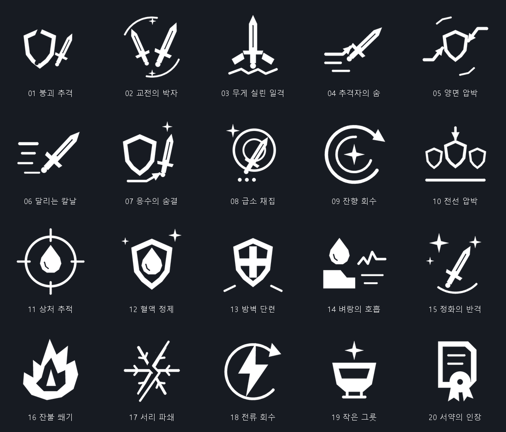

# TOOSIN — Version 1.3 Development Update

**As of September 8, 2026** · [한국어](DEVELOPMENT_UPDATE_2026-09-08_KR.md) · [About the game](README_EN.md)

The current development build adds **20 Perks** designed to work with existing Traits and Contracts, alongside **Sword Wave visibility and parry improvements**. This is a development progress report; it does not announce a Steam or STOVE release date or confirm store availability for these changes.

## From Version 1.1 to the current 1.3 development build

- **Guard Shove:** press Light Attack while guarding to perform a kick-based shove. Players and AI can use it, with AI choosing its use and response according to distance, SP, and combat habits.
- **Season 2's 5v5 battles:** one player and four allied AI fighters face five enemy AI fighters. Choose one of two factions and take part in Territory War. If the player falls while allies remain, spectator mode lets the battle continue to its conclusion.
- **Rewards through Stage 1000:** reward rules extend through Stage 1000 while preserving the existing Stage 1–200 rewards. Late-stage and Infinite Mode enemy growth also reflects actual progression, difficulty, and Combat Power.
- **100 advanced T6–T10 Traits:** unlocked Traits remain active without a separate equip step, while each effect still requires its activation conditions. Status icons, afterimages, marks, and barriers help show what is happening in combat.
- **Infinite Mode results and shared rank bonuses:** each attempt distinguishes the stage reached from the stage cleared. Normal combat applies only the single best rank 1–9 bonus among the latest platform-verified Stage, Ranked, and Infinite Mode ranks in the current session. The three mode bonuses do not stack.
- **Territory risk and faction boosts:** personal season score is distinguished from territory contribution over the last 14 days. A faction's territorial advantage provides a boost only during Ranked battles in that territory, and territory conditions also affect battle risk and rewards.
- **Group-fight targets and impact feedback:** Ranked and Infinite Mode show a white outline on the current target while at least two enemies are alive. Blade-following trails, hit and parry camera responses, blood, and contact dust have also been refined.
- **Arena atmosphere and hands-on training:** Roman-style sand, soil, stone, and cloth have been refined. First-combat practice now follows actual combo hits, guards, parries, dodges, and shoves, alongside improvements to descriptions, scrolling, and gamepad navigation.

## 20 new Perks

Each Perk can reach **three stacks**. The **1 / 2 / 3 values are the total effect at each stack level**, not values to add together. At three stacks, the final base value and an additional capstone effect are both active.

HP means Health, and SP means Stamina. Posture damage and damage to a guarding enemy's SP are distinct from HP damage. Attack-cost refunds use the SP actually spent on that attack. English Perk names below are descriptive translations of the Korean names.

| Perk | Effect at 1 / 2 / 3 stacks | Three-stack capstone |
|---|---|---|
| **Break Pursuit** · 붕괴 추격 | After you cause a guard break, your first direct hit against that enemy within 3 seconds deals +10% / 15% / 20% damage. | If the follow-up is a heavy attack, refund 25% of its actual SP cost. |
| **Combat Rhythm** · 교전의 박자 | Alternating light and heavy hits against the same enemy within 3 seconds grants +5% / 8% / 12% damage on the alternating hit. | Every three alternating hits, the next attack that lands refunds 25% of its actual SP cost. |
| **Weighted Strike** · 무게 실린 일격 | Fully charged attacks deal +10% / 20% / 30% posture damage. | After a fully charged direct hit, the first light attack within 3 seconds deals +25% damage. |
| **Pursuer's Breath** · 추격자의 숨 | The first attack that lands within 1.5 seconds of a dodge refunds 10% / 15% / 20% of its actual SP cost. | If that hit is critical, gain +15% movement speed toward the enemy for 2 seconds. |
| **Two-Sided Pressure** · 양면 압박 | Direct attacks from the side or rear deal +6% / 9% / 12% damage. | After a rear hit, the first frontal attack against the same enemy within 3 seconds deals +35% posture damage. |
| **Running Blade** · 달리는 칼날 | Move under your own control for 2 seconds to give your next attack +6% / 10% / 14% damage. | Landing the empowered attack grants +15% movement speed for 2 seconds. |
| **Riposte Breath** · 응수의 숨결 | The first attack within 3 seconds of a parry costs 10% / 15% / 20% less SP. | After that attack lands, your next guard within 3 seconds costs 25% less SP. Applies once. |
| **Critical Harvest** · 급소 채집 | Critical hits deal +10% / 15% / 20% posture damage. | Every three critical hits, your next heavy attack deals +30% damage to the enemy's guard SP. |
| **Echo Recovery** · 잔향 회수 | For 4 seconds after directly using a Special Ability, weapon hits reduce its cooldown by 0.2 / 0.35 / 0.5 seconds. Up to three triggers per use. | Trigger all three reductions to give your next directly used Special Ability +20% posture damage. Reproduced abilities do not qualify. |
| **Frontline Pressure** · 전선 압박 | Heavy attacks gain +5% / 8% / 10% posture damage per enemy hit, counting up to three enemies. | Directly hit at least two enemies with a heavy attack to give your next light attack +25% damage. |
| **Wound Tracking** · 상처 추적 | After an enemy deals HP damage to you, your first direct hit against that enemy within 4 seconds deals +8% / 12% / 16% damage. Self-damage does not qualify. | Landing the empowered attack grants +25% natural SP regeneration for 3 seconds. 6-second cooldown. |
| **Blood Refinement** · 혈액 정제 | Multiply final lifesteal healing, after Contract effects, by 1.10 / 1.20 / 1.30. No effect if lifesteal is zero or negative. | Gain a barrier equal to 20% of HP actually restored through lifesteal. This Perk's barrier contribution is capped at 5% of maximum HP. |
| **Barrier Training** · 방벽 단련 | A successful parry grants a barrier equal to 2% / 3% / 4% of maximum HP for 4 seconds. 8-second cooldown. | Your first heavy attack while you have a barrier deals +30% posture damage. 6-second cooldown. |
| **Breath at the Brink** · 벼랑의 호흡 | At 30% HP or below, attacks cost 8% / 12% / 16% less SP. | Parrying at low HP grants +40% natural SP regeneration for 3 seconds. 8-second cooldown. |
| **Purifying Reprisal** · 정화의 반격 | When a harmful status is removed or expires, gain +6% / 9% / 12% direct attack damage for 4 seconds. 6-second cooldown. | The first heavy attack during the buff deals +30% posture damage. Does not cleanse Contract drawbacks. |
| **Ember Wedge** · 잔불 쐐기 | Direct attacks against burning enemies deal +6% / 9% / 12% damage. Does not increase burn damage. | Heavy attacks against burning enemies deal +30% posture damage. 4-second cooldown. |
| **Frost Shatter** · 서리 파쇄 | Deal +10% / 15% / 20% posture damage to enemies with reduced movement or attack speed. | The first heavy attack against a frozen enemy deals +25% damage. 6-second cooldown per target. Does not extend the freeze. |
| **Current Recovery** · 전류 회수 | Direct attacks against enemies at 30% SP or below deal +6% / 9% / 12% damage. | A heavy hit against a qualifying enemy refunds 25% of the attack's actual SP cost. 6-second cooldown. |
| **Small Vessel** · 작은 그릇 | Starting an attack at 80% SP or above grants that attack +6% / 9% / 12% damage, measured against your final maximum SP. | Landing the empowered attack refunds 15% of its actual SP cost. 3-second cooldown. |
| **Oath Seal** · 서약의 인장 | Gain +2% / 3% / 4% posture damage per distinct Contract you hold, counting up to five Contracts. | Your first parry each round grants a barrier for 5 seconds, worth 1% of maximum HP per Contract, up to 5%. |

### Working with existing Traits and Contracts

- **Follow through after a guard break:** an existing guard-breaking Trait can open the enemy's guard, then Break Pursuit empowers your follow-up. The hit that causes the break does not also receive the follow-up reward.
- **Keep Contract benefits and costs meaningful:** Blood Refinement uses lifesteal after Contract modifiers, and Purifying Reprisal does not remove Contract drawbacks. Oath Seal counts only distinct Contracts actually applied to its owner. Enemies follow the same rule.
- **Connect new bonuses to existing effects:** existing Perk effects are preserved, and new conditional damage bonuses add together. Existing Trait refunds take priority; combined new refunds remain within the SP actually spent. Repeated contact from the same attack does not grant duplicate rewards.
- **Build around status effects:** Ember Wedge rewards directly attacking a burning enemy; burn ticks do not trigger another round of weapon-hit effects. Frost Shatter distinguishes ordinary slows from the freeze required by its capstone.
- **Respect unlocks and saved progress:** Weighted Strike enters the normal reward pool when charged attacks are unlocked, and Oath Seal requires a Contract. Saving, loading, and round transitions preserve the three-stack limit, while temporary bonuses and target tracking reset for the round.

### Perk icons

All 20 Perks have **white icons with transparent backgrounds**. The preview below shows them against a dark background.

## Sword Wave: easier to see and parry

- **Launch speed: 500 → 400; reflection speed also set to 400.** The wave now travels 20% slower than its previous launch speed, giving players more time to read and respond to it.
- **A thicker white core:** the central silhouette and elemental effects are thicker, including when viewed head-on. The existing collision size is preserved.
- **Travel distance preserved:** lifetime has been adjusted for the slower speed to retain the previous travel distance of approximately 20 metres.
- **Parry and reflect for both players and enemies:** successful Sword Wave parries now connect to parry rewards. Reflection ownership and repeated-contact handling have been corrected, and Perk bonuses captured when the wave is fired are preserved through later casts and reflections.

## Verification and further testing

The development build and automated combat, Trait, Perk, save, and UI checks passed. Sword Wave and icon rendering were checked on the GPU, along with visual comparisons of existing Trait effects. New Perks and icons were also saved and reloaded while preserving the existing Perk data.

Long-session playtesting, combination balance, and release-distribution checks remain separate validation steps. This development report does not establish the store release status of these changes.

---

[About the game](README_EN.md) · [Changelog](CHANGELOG_EN.md) · [Patch notes](PATCHNOTE_EN.md) · [한국어](DEVELOPMENT_UPDATE_2026-09-08_KR.md)
