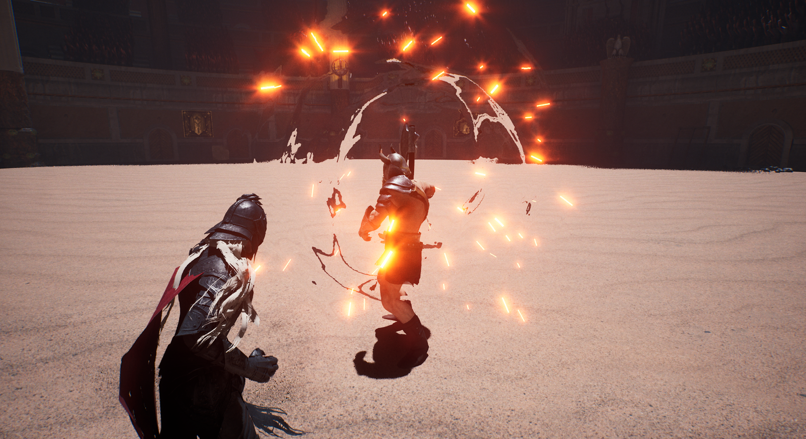

# TOOSIN : 투신

### Surpass the AI that learns from you.

**An arena roguelike action game built with Unreal Engine 5.5.**
Read your opponent, build your fighter, and surpass adaptive enemies that learn from the way you fight.

**Version 1.0 launched on August 13, 2026, concluding Early Access. Version 1.1 was released on August 23, 2026.**

[한국어](README_KR.md) · [English](README_EN.md)

## Version 1.1 at a glance

- Rebalanced 12 Blood Contracts and reduced Auto Parry, Aegis Shield, and Time Stop durations
- Expanded adaptive combat learning across attack, movement, defense, timing, ability, and dodge-to-heavy habits
- Added a hold-to-view TAB/Y learning panel that explains observations, confidence, planned responses, and executed actions
- Added a first-launch controls tutorial before pattern training
- Improved multilingual layouts, shared fonts, Trait-state colors, window transitions, and Steam stability
- Enemy Special Abilities unlock from Campaign Stage 100 and Infinite Round 10

## Public documentation

| 한국어 | English |
|---|---|
| [게임 소개](README_KR.md) | [Game overview](README_EN.md) |
| [개발 로드맵](ROADMAP.md) | [Development roadmap](ROADMAP_EN.md) |
| [변경 기록](CHANGELOG.md) | [Changelog](CHANGELOG_EN.md) |
| [패치 노트](PATCHNOTE.md) | [Patch notes](PATCHNOTE_EN.md) |
| [V1.1 업데이트](V1.1_UPDATE_KR.md) | [V1.1 update](V1.1_UPDATE_EN.md) |
| [지원 안내](SUPPORT.md) | [Support](SUPPORT_EN.md) |

## Official links

[Trailer](https://youtu.be/TrSGI-_k3KQ?si=Ldi4LljXUcPoyivW) ·
[Steam](https://store.steampowered.com/app/4635530/TOOSIN/) ·
[Steam Demo](https://store.steampowered.com/app/4786560/TOOSIN___Demo/) ·
[STOVE](https://store.onstove.com/ko/games/104376) ·
[Website](https://teamniriz.com/) ·
[Discord](https://discord.gg/EHMwJSjWpA) ·
[Support](mailto:support@teamniriz.com)

© 2026 TEAM NIRIZ. All rights reserved.

