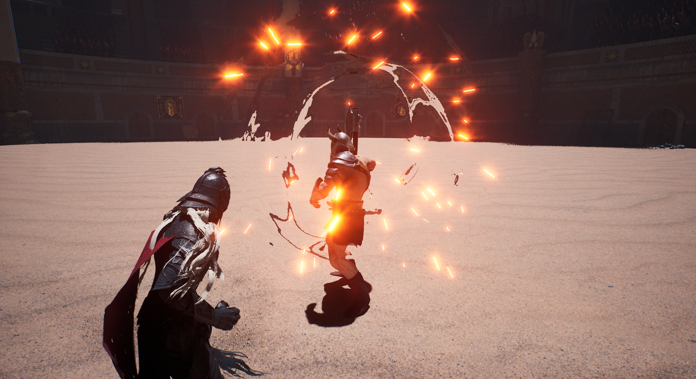

# TOOSIN : 투신

### Surpass the AI that learns from you.

**An arena roguelike action game built with Unreal Engine 5.5.**
Read your opponent, build your fighter, and surpass adaptive enemies that learn from the way you fight.

**Version 1.0 launched on August 13, 2026, concluding Early Access. Version 1.1 was released on August 23, 2026.**

[한국어](README_KR.md) · [English](README_EN.md)

## [Version 1.3.1] 20 New Perks, Existing Perk Fixes and Sword Wave Improvements

- **20 new Perks**: up to three stacks with an additional effect at three stacks. Stack values are final totals, not additive. The detailed notes include all 20 effect rows.
- **Existing Perk fixes**: Combo Master now gains combo stacks only from light attacks dealing actual HP damage; Giant’s Grip defense was adjusted to 3% / 6% / 6%.
- **Description corrections**: clarified Lifesteal, Thunderbolt and Sturdy Guard. These corrections are distinguished from gameplay balance changes.
- **Application and save stability**: fixed leftover bonuses after resets or removal, duplicate Trait records, repeated application on load, and duplicate triggers and SP refunds.
- **Icons and Sword Wave**: dedicated white icons and six-language descriptions; improved wave visibility, travel speed while preserving range, and player/enemy parrying and reflection.

[Full update notes](V1.3.1_UPDATE_EN.md)

---

## [Version 1.3] 100 Advanced Traits, Rank Bonuses, Combat and Arena Improvements

- **100 advanced T6–T10 Traits**: 20 per branch across five branches, costing 3,000 TP in total. Unlocked Traits apply when their individual activation conditions are met.
- **Trait states and effects**: 42 status indicators, pose afterimages, barriers and shockwaves, plus progression-based advanced Trait assignments for enemies.
- **Infinite Mode rank bonuses**: apply one bonus set from the best currently confirmed rank among Stage, Season 2 and Infinite Mode, for ranks 1–9. Results distinguish the stage reached from the last stage cleared.
- **Season 2 risk and rewards**: territory influence affects enemy stats, AI difficulty and victory points; added local Ranked faction buffs and confirmed personal contributions over the last 14 days.
- **Combat, graphics and training**: white multi-enemy target outlines, weapon trails, blood and camera feedback, Roman arena materials and rendering optimization, and hands-on training based on successful actions.

[Full update notes](V1.3_UPDATE_EN.md)

---

## [Version 1.2] Season 2: Shattered Throne, 5v5 Territories, Combat and Progression — 2026.09.01

- **Ranked Season 2 — Shattered Throne**: one player and four allied AI fight five enemy AI in a new arena, with free spectator controls after death and team HUDs.
- **Factions and territories**: Blood Crown and Ashen Oath, seven territories, three weekly active fronts and rolling 14-day influence. Personal season score and territory influence are separate records.
- **Guard Shove and AI**: use a light attack while guarding to shove; improved AI learning for shoves, dodges and counters, alongside combat information.
- **Progression, rewards and achievements**: revised enemy growth using Stage/Round, difficulty, grade and Combat Power; extended rewards through Stage 1000 and reworked 11 achievements around stage rewards.
- **UI and convenience**: unified Combat Power and stat displays; improved Season 2 screens, six languages, Steam announcements, Overlay pause, borderless mode and ragdolls.

[Full update notes](V1.2_UPDATE_EN.md)

## Version 1.1 at a glance

- Rebalanced 12 Blood Contracts and reduced Auto Parry, Aegis Shield, and Time Stop durations
- Expanded adaptive combat learning across attack, movement, defense, timing, ability, and dodge-to-heavy habits
- Added a hold-to-view TAB/Y learning panel that explains observations, confidence, planned responses, and executed actions
- Added a first-launch controls tutorial before pattern training
- Improved multilingual layouts, shared fonts, Trait-state colors, window transitions, and Steam stability
- Enemy Special Abilities unlock from Campaign Stage 100 and Infinite Round 10

## Public documentation

| 한국어 | English |
|---|---|
| [V1.2 업데이트](V1.2_UPDATE_KR.md) | [V1.2 update](V1.2_UPDATE_EN.md) |
| [V1.3 업데이트](V1.3_UPDATE_KR.md) | [V1.3 update](V1.3_UPDATE_EN.md) |
| [V1.3.1 업데이트](V1.3.1_UPDATE_KR.md) | [V1.3.1 update](V1.3.1_UPDATE_EN.md) |
| [게임 소개](README_KR.md) | [Game overview](README_EN.md) |
| [개발 로드맵](ROADMAP.md) | [Development roadmap](ROADMAP_EN.md) |
| [변경 기록](CHANGELOG.md) | [Changelog](CHANGELOG_EN.md) |
| [패치 노트](PATCHNOTE.md) | [Patch notes](PATCHNOTE_EN.md) |
| [V1.1 업데이트](V1.1_UPDATE_KR.md) | [V1.1 update](V1.1_UPDATE_EN.md) |
| [지원 안내](SUPPORT.md) | [Support](SUPPORT_EN.md) |

## Official links

[Trailer](https://youtu.be/TrSGI-_k3KQ?si=Ldi4LljXUcPoyivW) ·
[Steam](https://store.steampowered.com/app/4635530/TOOSIN/) ·
[Steam Demo](https://store.steampowered.com/app/4786560/TOOSIN___Demo/) ·
[STOVE](https://store.onstove.com/ko/games/104376) ·
[Website](https://teamniriz.com/) ·
[Discord](https://discord.gg/EHMwJSjWpA) ·
[Support](mailto:support@teamniriz.com)

© 2026 TEAM NIRIZ. All rights reserved.

