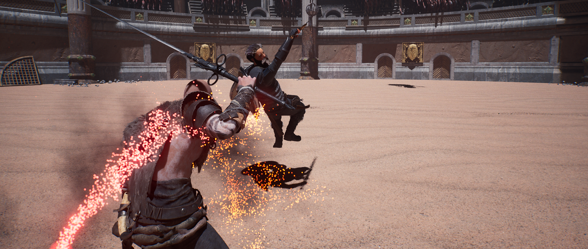
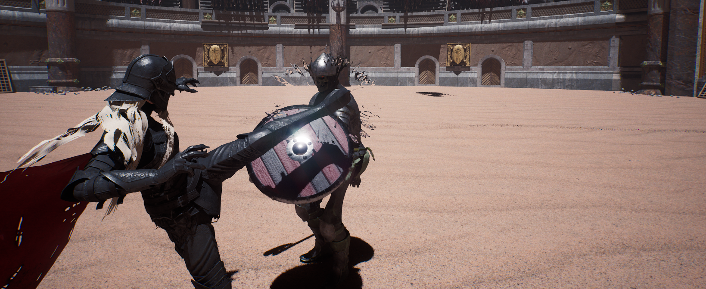

  <a href="README_KR.md">🇰🇷 한국어</a> · <strong>🇺🇸 English</strong>

# TOOSIN : 투신

### Surpass the AI that learns from you

**TOOSIN** is an **arena roguelike action game** about overcoming adaptive enemies that read your attack, guard, dodge, movement, and spacing habits. Combine three classes with weapons, combos, Traits, Perks, Mastery, and Special Abilities to build your own fighting style.

**Version 1.0 launched on August 13, 2026, concluding Early Access.**

[Steam](https://store.steampowered.com/app/4635530/TOOSIN/) ·
[STOVE](https://store.onstove.com/ko/games/104376) ·
[Website](https://teamniriz.com/) ·
[Discord](https://discord.gg/EHMwJSjWpA) ·
[Support](mailto:support@teamniriz.com)

Click the image to watch the official Version 1.0 trailer.

## Release history

| Milestone | Date | Status |
|---|---:|:---:|
| STOVE Early Access | April 17, 2026 | Complete |
| Steam Early Access | May 6, 2026 | Complete |
| Version 1.0 Beta | August 4, 2026 | Complete |
| Version 1.0 full release · Early Access graduation | **August 13, 2026** | **Released** |

## Version 1.0 highlights

### Adaptive AI and combat memory

Enemies do more than repeat fixed scripts. Attack choices, defensive timing, dodge direction, spacing, and movement feed a session's combat memory and influence later decisions. Distinct enemy personalities and readable learning logs show what the AI has recognized.

> TOOSIN does not use generative AI or a continuously trained online model. Its adaptive combat system uses in-game player-pattern statistics and rule-based decisions.

### Reactive melee combat

- Light, heavy, and charged attacks with weapon- and class-specific combos
- Guarding, parrying, just dodges, guard breaks, and directional hit reactions
- Distance- and direction-aware knockback with camera, vibration, and screen feedback
- Improved blood and impact VFX based on enemy type and hit location

  
  

### Progression and builds

- Three classes with interchangeable weapons, combos, and appearances
- 100+ Traits, 20+ Perks, Mastery, and Special Abilities including Time Stop
- Default-weapon enhancement up to +30 plus permanent account XP and Play Point growth
- Run-based Traits reset on death, while spent Play Points are refunded
- Unlocked weapons, combos, appearances, and Special Abilities remain permanently owned and leave the reward pool

### Modes and competitive records

- **Stage Mode**: the core run structure, combining rewards and random events into evolving builds
- **Infinite Mode**: unlimited rounds that preserve current Health and Stamina, feature encounters up to 1 vs. 5, and post to a dedicated leaderboard
- **Ranked Season 1**: placement matches, tier rewards, platform leaderboards, and matched AI rivals
- **Training and Mock Combat**: safe environments for testing combat systems and builds

### DDA and Combat Power

DDA uses play patterns and progression state to tune combat flow and enemy choices. Combat Power summarizes equipment, growth, and attributes on a scale recorded and compared up to **1,000,000**.

### Release quality

- Steam and STOVE achievements, stats, and leaderboards
- English, Korean, Japanese, Simplified Chinese, Traditional Chinese, and Russian
- Stabilized saving/loading, permanent unlocks, rewards, contracts, buffs, and option persistence
- Improvements to long sessions, map transitions, cameras, collision, clipped UI, and input flows

## Game information

| | |
|---|---|
| Developer / Publisher | TEAM NIRIZ |
| Engine | Unreal Engine 5.5 |
| Platform | Windows PC · Steam · STOVE |
| Genre | Action Roguelike · Action RPG · Single-player |
| Languages | English · Korean · Japanese · Simplified Chinese · Traditional Chinese · Russian |
| Steam features | Achievements · Cloud · Stats · Leaderboards · Family Sharing |

## System requirements

| | Minimum | Recommended |
|---|---|---|
| OS | Windows 10/11 64-bit | Windows 10/11 64-bit |
| Processor | Intel Core i5-8400 / AMD Ryzen 5 2600 | Intel Core i7-9700K / AMD Ryzen 7 3700X |
| Memory | 8 GB RAM | 16 GB RAM |
| Graphics | NVIDIA GeForce RTX 2060 | NVIDIA GeForce RTX 3060 |
| DirectX | Version 12 | Version 12 |
| Storage | 8 GB | 10 GB |

## Documentation and contact

- [Release roadmap](ROADMAP_EN.md) · [Changelog](CHANGELOG_EN.md) · [Detailed patch notes](PATCHNOTE_EN.md) · [Support and bug reports](SUPPORT_EN.md)
- [Version 1.0 trailer](https://youtu.be/TrSGI-_k3KQ?si=Ldi4LljXUcPoyivW) · [Website](https://teamniriz.com/) · [Discord](https://discord.gg/EHMwJSjWpA) · [Support](mailto:support@teamniriz.com)

© 2026 TEAM NIRIZ. All rights reserved.

