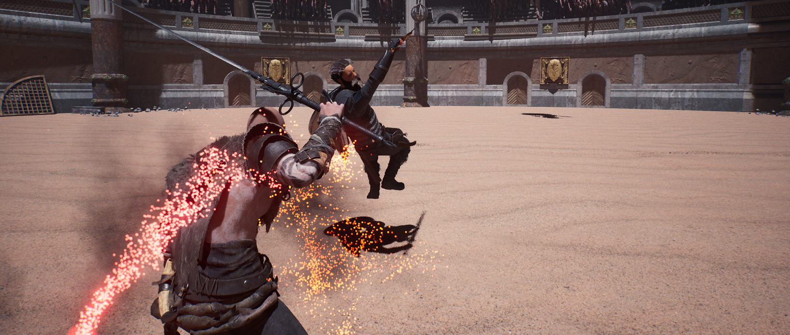
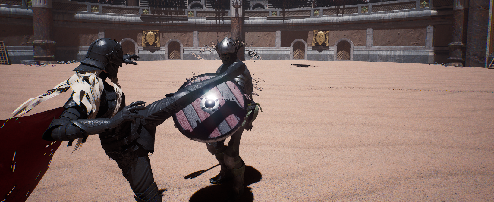

# TOOSIN : 투신

[한국어](README_KR.md) · [Documentation index](README.md)

TOOSIN is a single-player arena action roguelike built with Unreal Engine 5.5. It records attack choices, guard timing, dodges and spacing, then uses those observations in enemy AI decisions. Three classes—Warrior, Swordsman and Fighter—can be combined with weapons, combos, Traits, Perks and Special Abilities.

[Steam](https://store.steampowered.com/app/4635530/TOOSIN/) · [STOVE](https://store.onstove.com/ko/games/104376) · [Demo](https://store.steampowered.com/app/4786560/TOOSIN___Demo/)

## Current status

Updated October 1, 2026. Version 1.0 launched on August 13, 2026 (Korea time). This repository contains public update records through Version 1.3.1.

**Version 1.4 is in preparation.** Codex and Claude assist implementation, debugging and documentation. Current work covers the hub and menus, appearance and class selection, combat animations, AI, saving and localization. Development builds, automated checks and selected runtime captures have been recorded; packaging and remaining play checks are still in progress. The release date and final scope will be announced once confirmed.

[1.4 preparation and verification scope](DEVELOPMENT_UPDATE_2026-10-01_EN.md) · [Roadmap](ROADMAP_EN.md)

## Combat and progression

- Light, heavy and charged attacks, with class and weapon-specific combos
- Guarding, parrying, dodging, guard breaks and knockback
- Builds combining weapons, combos, Traits, Perks, Mastery and Special Abilities
- Permanent unlocks for weapons, combos, appearances and Special Abilities
- AI learning information while holding TAB or controller Y

Combat AI uses in-game behavior statistics and rule-based decisions. Generative AI tools assist development and are separate from the game's combat AI.

  
  

## Modes

| Mode | Description |
|---|---|
| Stage | Progress through battles, rewards and random events |
| Infinite | Continue through rounds while retaining current Health and Stamina, with a dedicated leaderboard |
| Ranked Season 2 | One player and four allied AI versus five enemy AI, with season scores and territorial influence |
| Training | Practice controls and combat actions |

Ranked Season 2 is a single-player AI team battle. Seasonal records and territorial influence are aggregated through platform records.

## Public update records

| Version | Main changes | Notes |
|---|---|---|
| 1.3.1 | 20 new Perks, existing Perk fixes and Sword Wave improvements | [Details](V1.3.1_UPDATE_EN.md) |
| 1.3 | 100 advanced Traits, rank bonuses, combat and arena improvements | [Details](V1.3_UPDATE_EN.md) |
| 1.2 | Season 2 5v5 territories, combat and progression | [Details](V1.2_UPDATE_EN.md) |
| 1.1 | AI learning, Blood Contracts, tutorial and UI | [Details](V1.1_UPDATE_EN.md) |

Each document describes its own version. Changes being prepared for 1.4 are recorded separately in the current development note.

## Game information

| Item | Details |
|---|---|
| Developer and publisher | TEAM NIRIZ |
| Engine | Unreal Engine 5.5 |
| Platform | Windows PC, Steam, STOVE |
| Genre | Action roguelike, action RPG, single-player |
| Languages | Korean, English, Japanese, Simplified Chinese, Traditional Chinese, Russian |

## System requirements

| Item | Minimum | Recommended |
|---|---|---|
| OS | Windows 10/11 64-bit | Windows 10/11 64-bit |
| Processor | Intel Core i5-8400 / AMD Ryzen 5 2600 | Intel Core i7-9700K / AMD Ryzen 7 3700X |
| Memory | 8 GB RAM | 16 GB RAM |
| Graphics | NVIDIA GeForce RTX 2060 | NVIDIA GeForce RTX 3060 |
| DirectX | Version 12 | Version 12 |
| Storage | 8 GB | 10 GB |

These requirements are listed on the [Steam store](https://store.steampowered.com/app/4635530/TOOSIN/). Check the installed build and platform announcements as well.

## Documentation and contact

[Changelog](CHANGELOG_EN.md) · [Patch notes](PATCHNOTE_EN.md) · [Support and bug reports](SUPPORT_EN.md) · [Website](https://teamniriz.com/) · [Discord](https://discord.gg/EHMwJSjWpA) · [Support email](mailto:support@teamniriz.com)

This repository stores game information and public update records. The game source is maintained separately.

© 2026 TEAM NIRIZ.
